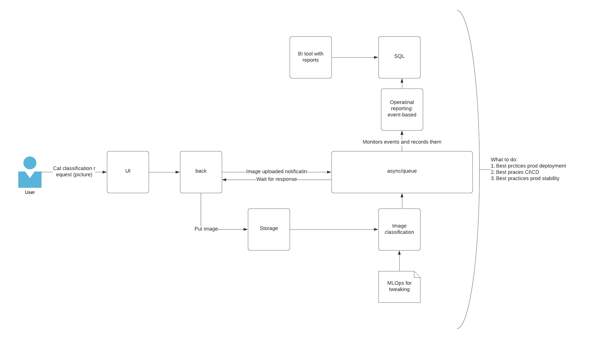

# Project description

# Project Structure

## Categorize
CNN network and application code to perform inference

## Common
Storage, config and queue code

## Dispatcher
Backend to get picture and handle user response

## Docs
Documentation-related imgaesand files

## Reporting
Collection and visalization of user activity

## UI
User interface files

# Concepts
This project was intentially created the way it was created
